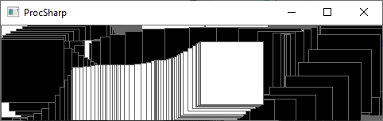

# ProcSharp
An interpretation of the Processing framework in C#

## Installation
### Installing ProcSharp as a Visual Studio extension (recommended)
The recommended way of installing ProcSharp is to install the ProcSharp Visual Studio extension. It includes project templates for creating a ProcSharp app and also includes all native libraries that ProcSharp depends on. Install it through Visual Studio or read more about it [here](https://marketplace.visualstudio.com/items?itemName=ProcSharp.windows-app-template).

### Installing ProcSharp using NuGet
Create a new Console App (.NET Core) and add a reference to ProcSharp using NuGet. The following code shows how to set up a simple ProcSharp program. In addition to added ProcSharp as a NuGet reference you also need to include all native library references that SDL requires. They can be found [here](https://www.libsdl.org/download-2.0.php).

## Usage
Create a new ProcSharp App in Visual Studio, open upp the Game.cs file and write your code there. See out [project wiki](https://github.com/simoneddeland/proc-sharp/wiki) for an API reference.
### Hello ProcSharp
#### Game.cs
```csharp
using System;
using System.Collections.Generic;
using System.Text;
using ProcSharpCore;
using static ProcSharpCore.ProcSharp;

namespace ProcSharpUser
{
    class Game
    {
        public void Setup()
        {
            Size(480, 120);
        }

        public void Draw()
        {
            if (MousePressed)
            {
                Fill(0);
            }
            else
            {
                Fill(255);
            }
            Square(MouseX, MouseY, 80);
        }

    }
}
```
If you didn't install the ProcSharp templates as a Visual Studio extension, you need to edit your Program.cs to

#### Program.cs
```csharp
using System;
using ProcSharpCore;

namespace ProcSharpUser
{
    class Program
    {
        static void Main(string[] args)
        {
            ProcSharp.Initialize(typeof(Game), new Game());
        }
    }
}
```

This is a screenshot from the example program.



### Drawing images
The following example shows how to load and draw an image. The image file "moose.png" should be places in the folder called "content" which is included in the ProcSharp template.

```csharp
using System;
using System.Collections.Generic;
using System.Text;
using ProcSharpCore;
using static ProcSharpCore.ProcSharp;

namespace ProcSharpUser
{
    class Game
    {

        PImage testImage;

        public void Setup()
        {
            Size(1280, 720);
            testImage = LoadImage("moose.png");
        }

        public void Draw()
        {
            Background(255, 255, 255);

            Image(testImage, MouseX, MouseY, 100, 200);

        }

    }
}
```

## Contributing
See the [CONTRIBUTING.md](https://github.com/simoneddeland/proc-sharp/blob/master/CONTRIBUTING.md) for information on how to contribute to ProcSharp.

## Credits
...

## License
Licensed under the MIT license.